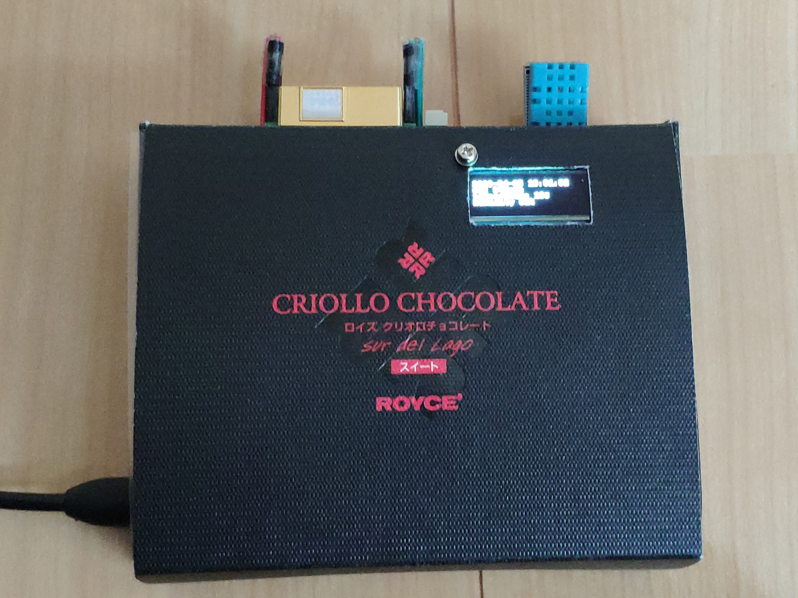
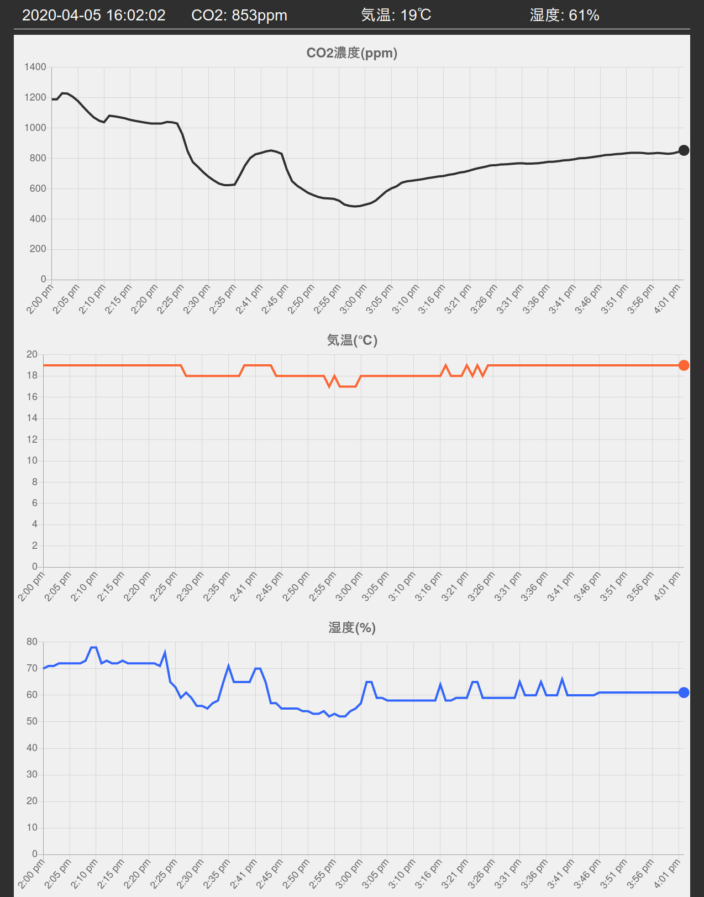

Raspberry Pi ZERO を使った周辺環境測定器

## 機能

* 1分おきに周辺環境を測定する
    - 気温
    - 湿度
    - CO2濃度
* 測定結果を液晶画面に表示する
* 測定履歴をWeb画面に表示する
    - http://${raspberry_piのIP}:8080/

## 用意するもの

* Raspberry Pi ZERO W (またはWH)
    - OSはRaspbian
* DHT11
* PiOLED
* MH-Z19

## 配線

[MH-Z19とPiOLEDの配線はこちら](https://cloudpack.media/47841)に、[DHT11の配線はこちら](https://codezine.jp/article/detail/10562)に従う

## セットアップ手順

1. Raspberry Pi ZEROにRaspbianをインストールする
2. 配線する
3. このリポジトリをcloneする
4. `./setup1.sh`
5. 再起動
6. `./setup2.sh`
7. 再起動

## 作例

### 製作例

### 測定例

(測定例では2:25pm-2:35pm, 2:45pm-3:00pmに換気)
